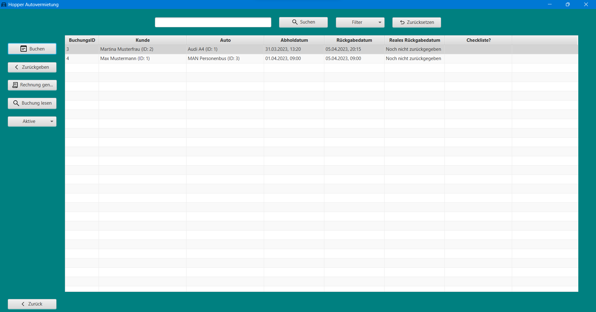
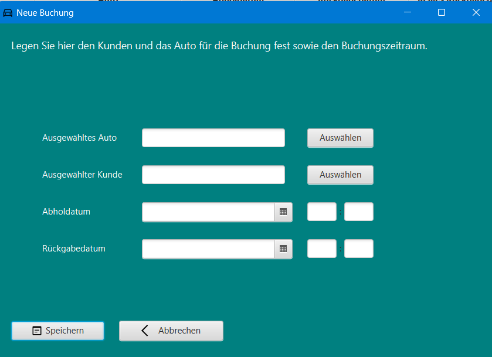
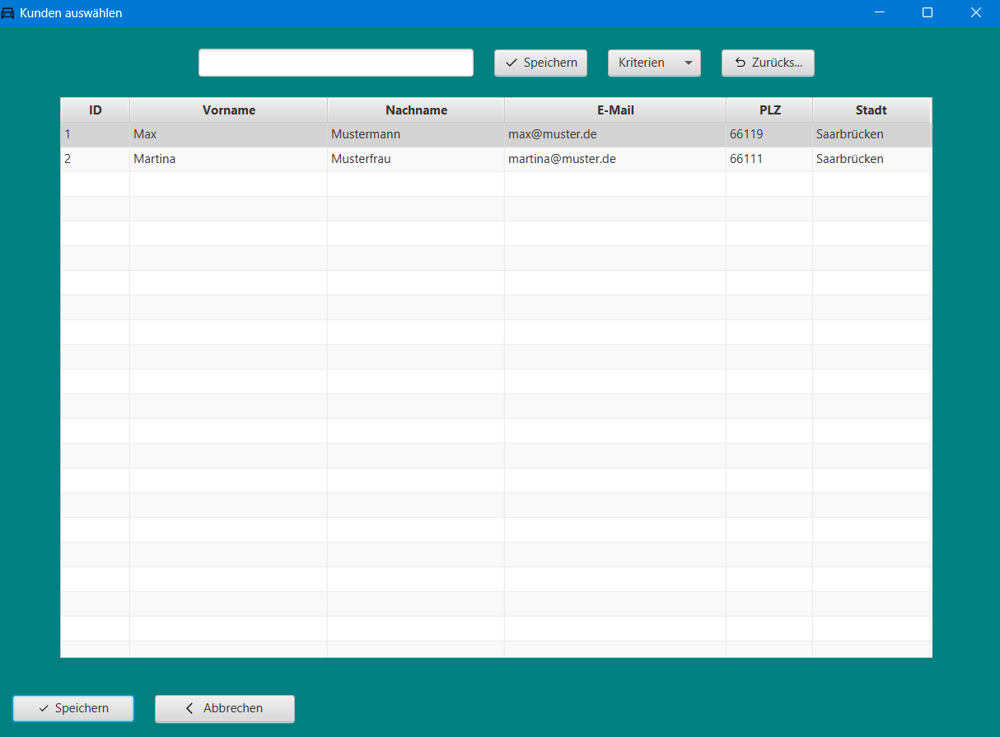
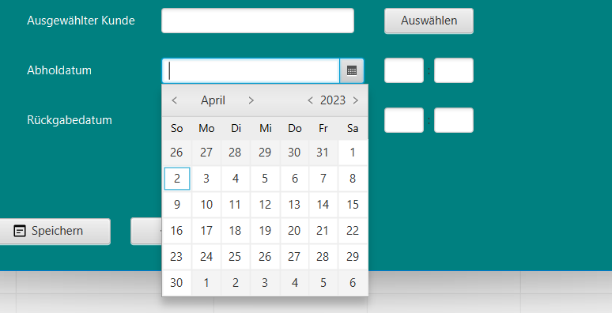
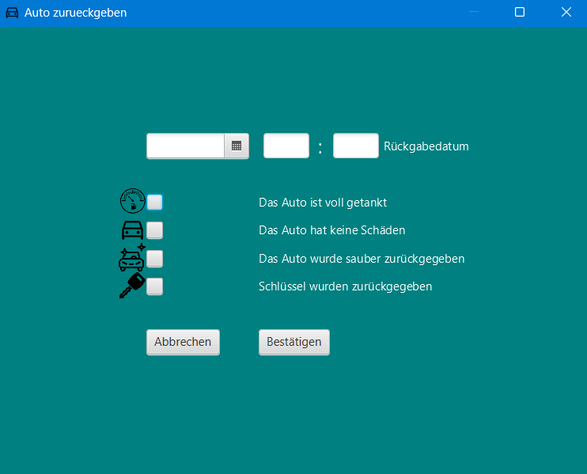
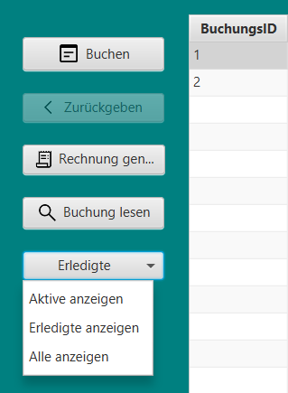
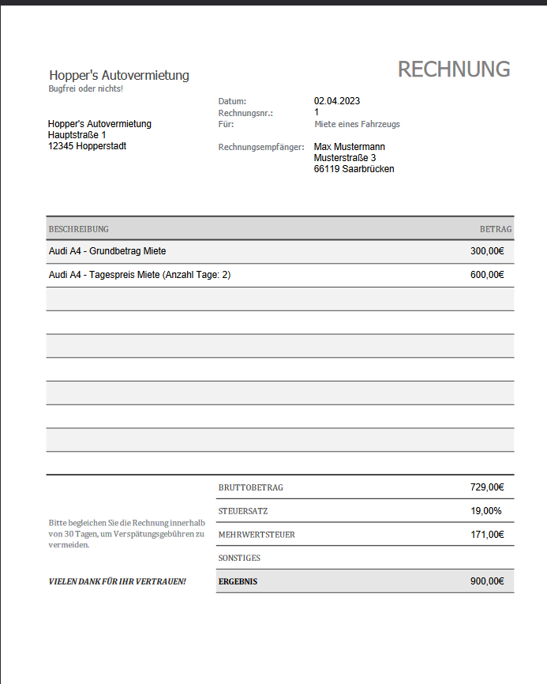
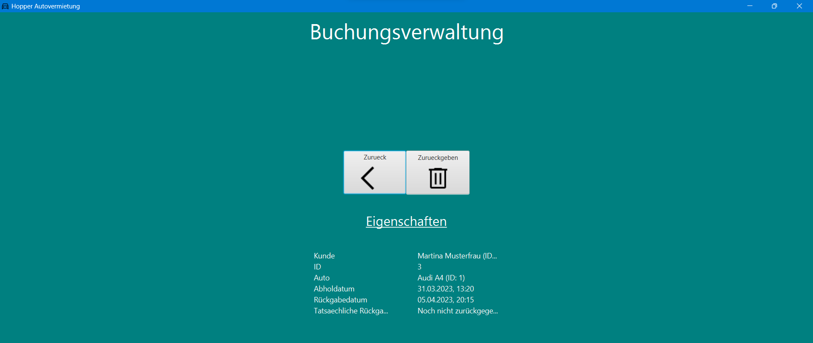

# Buchungsverwaltung

Die Buchungsverwaltung dient der Verwaltung aller laufenden und abgeschlossenen Buchungen. Sie hat folgende Funktionen:

* **Buchen**
* **Zurückgeben**
* **Rechnung generieren**
* **Buchung lesen**
* **Suchen**
* **Zurück**

## Buchen

Das Fenster für eine neue Buchung wird geöffnet. Es müssen ein Fahrzeug in der Datenbank und ein Kunde in der Datenbank
ausgewählt werden.
Die Auswahl erfolgt jeweils über neue Fenster, die bei Klick auf "Auswählen" geöffnet werden:

### Fahrzeug auswählen

Hier verhält sich die Suche im oberen Bereich analog zur Suche in der Fahrzeugverwaltung (siehe Sektion "
Fahrzeugverwaltung").  
Die verfügbaren Fahrzeuge werden in der Tabelle angezeigt. Durch Klick auf eines der Fahrzeuge wird das Fahrzeug
ausgewählt und nach der Auswahl und darauffolgendem Klick auf den Button "Speichern" wird das Auto in das Feld bei der
Verwaltung der neuen Buchung geladen und das Fenster geschlossen.

"Abbrechen" schließt das Fenster und die Auswahl wird verworfen.  
Es sei darauf hingewiesen, dass die Interaktion mit der Buchungsverwaltung während der Auswahl eines Fahrzeugs nicht
möglich ist, die angezeigten Fahrzeuge sind diejenigen, die in keiner Buchung vorkommen und somit verfügbar sind.

### Kunde auswählen

Hier verhält sich die Suche im oberen Bereich analog zur Suche in der Kundenverwaltung (siehe Sektion "
Kundenverwaltung").

Die verfügbaren Kunden werden in der Tabelle angezeigt.

Durch Klick auf einen der Kunden wird der Kunde ausgewählt und nach der Auswahl und darauffolgendem Klick auf den
Button "Speichern" wird der Kunde in das Feld bei der Verwaltung der neuen Buchung geladen und das Fenster geschlossen.

"Abbrechen" schließt das Fenster und die Auswahl wird verworfen.

Es sei darauf hingewiesen, dass die Interaktion mit der Buchungsverwaltung während der Auswahl eines Kunden nicht
möglich ist, die angezeigten Kunden sind diejenigen, die in keiner Buchung vorkommen und somit verfügbar sind.

### Datumsauswahl

Nach der Wahl des Fahrzeuges und des Kunden kann das Datum der Buchung ausgewählt werden. Hierbei ist zu beachten, dass
das Datum der Buchung nicht in der Vergangenheit liegen darf. Das Datum der Buchung muss zudem vor dem Datum der
Rückgabe liegen. Zudem muss eine Uhrzeit in die Felder rechts eingetragen werden. Diese muss ebenfalls gültig sein, also
sind Uhrzeiten am selben Tag in der Vergangenheit ungültig und werfen eine Fehlermeldung.

### Speichern

Nachdem alle Daten eingegeben wurden, kann die Buchung gespeichert werden. Dazu muss der Button "Speichern" geklickt
werden. Die Buchung wird in der Datenbank gespeichert und das Fenster geschlossen. Die Interaktion mit der
Buchungsverwaltung ist während des Speicherns nicht möglich.

### Abbrechen

Der Button "Abbrechen" schließt das Fenster und die Buchung wird nicht gespeichert.

## Zurückgeben

Ein Klick auf die jeweilige Buchung in der Tabelle wählt diese aus.

Durch Klick auf den Button "Zurückgeben" wird das Fenster zur Rückgabe des Fahrzeuges geöffnet. Hier kann das
tatsächliche Rückgabedatum sowie der Uhrzeit analog zur Buchung ausgewählt werden.  
Dabei ist zu beachten, dass das Rückgabedatum nicht vor oder gleich dem Abholdatum sein darf.

Die Checkboxen sind für die Erfassung der Mängel zuständig.   
Bei Klick auf eine der Checkboxen, ist der Mangel nicht vorhanden, bei Auslassen des Klicks, wird dies als Mangel
gewertet. Hier ist aus 4 Optionen zu wählen. Nachdem die Daten eingegeben wurden, kann die Rückgabe gespeichert werden.
Dazu muss der Button "Bestätigen" geklickt werden.

Die Rückgabe wird in der Datenbank gespeichert und das Fenster geschlossen. Die Interaktion mit der Buchungsverwaltung
ist während des Speicherns nicht möglich. Der Button "Abbrechen" schließt das Fenster und die Rückgabe wird nicht
gespeichert. Die erledigten Buchungen können über den linken Filter der Tabelle der Buchungsverwaltung eingesehen
werden.

## Filtern nach aktiven, beendeten und allen Buchungen

Das Dropdown-Menü ist initial auf "Aktive" gesetzt und ermöglicht es, die Tabelle nach aktiven, beendeten oder allen
Buchungen zu filtern. Die Auswahl erfolgt durch Klick auf den entsprechenden Eintrag. Die Tabelle wird nach der Auswahl
wieder zurückgesetzt und alle Buchungen angezeigt.

## Rechnung generieren

Bei Auswahl einer erledigten Buchung in der Tabelle analog zu allen Tabellensichten, kann der Button "Rechnung
generieren" geklickt werden.
Hier werden die Kosten für den Kunden angezeigt. Die Rechnung wird automatisch generiert und kann über den Button "
Rechnung anzeigen" angezeigt werden. Die Rechnung wird als PDF-Datei gespeichert und wird als neues Browserfenster
automatisch geöffnet und kann heruntergeladen werden.

## Buchung lesen

Bei Auswahl einer Buchung in der Tabelle analog zu allen Tabellensichten kann der Button "Buchung lesen" geklickt
werden.
Hier werden die Daten der Buchung angezeigt. Die Daten können nicht verändert werden. Jedoch kann durch Klick auf den
Button "Zurück" das Fenster geschlossen werden. Der Button "Zurückgeben" initiiert die Rückgabe der Buchung und das
Fenster wird bei erfolgter Buchung geschlossen und das Fenster der Buchungsverwaltung wird geöffnet.

## Suchen

Die Suche in der Tabelle der Buchungsverwaltung funktioniert analog zur Suche in der Tabelle der Fahrzeugverwaltung und
der Kundenverwaltung. Die Suche ist case-insensitive und findet alle Treffer, die die Sucheingabe enthalten. Die Suche
findet in allen Spalten der Tabelle statt. Die Suche kann durch Klick auf den Button "Suchen" gestartet werden. Die
Suche kann durch Klick auf den Button "Zurücksetzen" zurückgesetzt werden. Es kann zudem ein Suchkriterium ausgewählt
werden, in dem die Suche stattfinden soll. Die Auswahl erfolgt über das Dropdown-Menü.

## Zurück

Der Button "Zurück" schließt das Fenster und kehrt zur Startseite zurück.