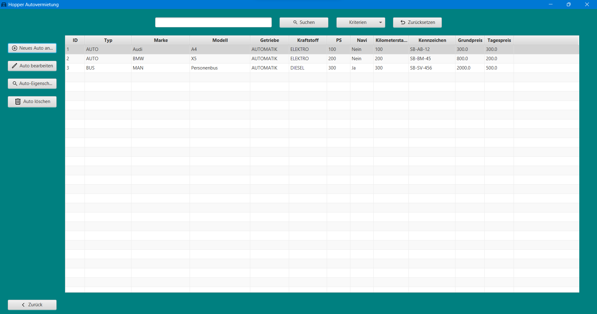
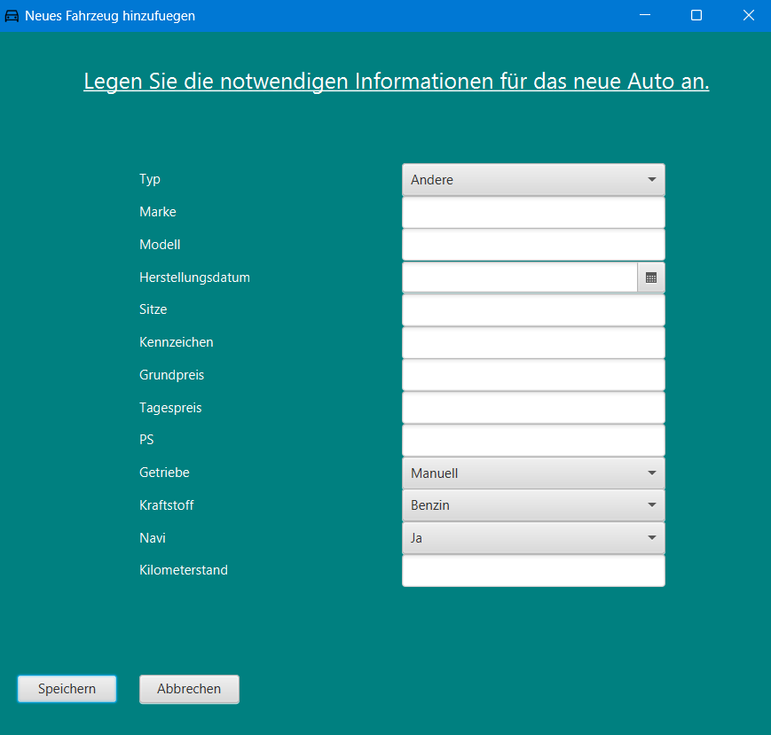
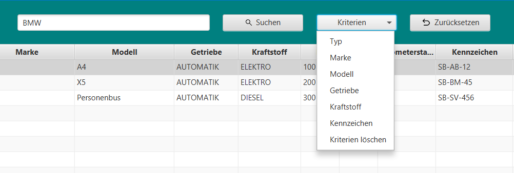

# Fahrzeugverwaltung

Die Fahrzeugverwaltung dient der Verwaltung der Fahrzeuge. Sie hat folgende Funktionen:

* **Neues Fahrzeug anlegen**
* **Fahrzeug bearbeiten**
* **Fahrzeug löschen**
* **Fahrzeug-Eigenschaften**
* **Suchen**
* **Zurück**

## Neues Fahrzeug anlegen

Öffnet das Fenster zum Anlegen eines neuen Fahrzeugs. Hier können die Eigenschaften des Fahrzeugs eingetragen werden.
Nach dem Klick auf "Speichern" wird das Fahrzeug in der Datenbank gespeichert und das Fenster geschlossen.

Dabei muss beachtet werden, dass die Eingabe von Daten in die Felder für das Speichern des Fahrzeuges Pflicht ist und
das Kennzeichen in der Form XX-XXX-XX eingetragen werden muss.

Durch Drücken der "Abbrechen" Taste wird das Fenster geschlossen und die Eingaben verworfen.
Während das Fenster für die Eingabe eines neuen Fahrzeugs geöffnet ist, kann nicht mehr mit der Fahrzeugverwaltung
interagiert werden.
Das Fenster muss zuerst wieder durch den "Abbrechen" Button geschlossen werden, oder durch das Klicken auf den "X"
Button in der oberen rechten Ecke des Fensters.

## Fahrzeug bearbeiten

Öffnet das Fenster zum Bearbeiten eines Fahrzeugs.

Hier können die Eigenschaften des Fahrzeugs bearbeitet werden. Die Daten des Fahrzeuges, welches bei der
Fahrzeugverwaltung in der Tabelle angeklickt wurde, werden in die Felder geladen. Nach dem Klick auf "Speichern" wird
das Fahrzeug in der Datenbank gespeichert und das Fenster geschlossen.

Analog zum Anlegen eines neuen Fahrzeugs muss auch hier die Eingabe von Daten in die Felder für das Speichern des
Fahrzeuges erfolgen und das Kennzeichen in der Form XX-XXX-XX eingetragen werden.

Wenn das Fahrzeug unverändert gespeichert werden soll, wird eine Fehlermeldung angezeigt. Es ist demnach Pflicht,
mindestens eine Eigenschaft zu ändern.

Die Interaktion mit der Fahrzeugverwaltung ist während des Bearbeitens eines Fahrzeugs ebenfalls nicht möglich.

## Fahrzeug löschen

Öffnet das Fenster zum Löschen eines Fahrzeugs. Das in der Tabelle angeklickte Fahrzeug ist ausgewählt.

Nach dem Klick auf "Löschen" muss die Meldung "Wagen wirklich löschen?" bestätigt werden.  
Nach der Bestätigung wird das Fahrzeug aus der Datenbank gelöscht und das Fenster geschlossen.

Während des Löschens eines Fahrzeugs ist die Interaktion mit der Fahrzeugverwaltung nicht möglich.  
Durch den "Abbrechen" Button wird das Fenster geschlossen und das Fahrzeug nicht gelöscht.

## Fahrzeug-Eigenschaften

Wechselt in das Fenster zur Anzeige der Eigenschaften eines Fahrzeugs. Das in der Tabelle angeklickte Fahrzeug ist
ausgewählt.

Durch den "Zurück" Button wird das Fenster geschlossen und die Fahrzeugverwaltung wieder geöffnet.

Das Klicken auf "Löschen" oder "Bearbeiten" öffnet das entsprechende Fenster wie in den vorherigen Abschnitten
beschrieben.

Dabei sei darauf hingewiesen, dass die Interaktion mit der Fahrzeugverwaltung während der Bearbeitung oder Löschung
eines Fahrzeugs nicht möglich ist und beim Löschen des Fahrzeuges die Anzeige der Eigenschaften des Fahrzeugs
geschlossen wird.

## Suchen

Über der Fahrzeugtabelle befindet sich ein Textfeld und ein Button "Suchen".  
Durch Eingabe eines Suchbegriffs in das Textfeld und anschließendem Klick auf den Button "Suchen" wird die Tabelle nach
Fahrzeugen gefiltert, die den Suchbegriff in ihren Eigenschaften enthalten.

Des Weiteren wird durch den Klick auf den Button "Suchen" die Tabelle wieder zurückgesetzt und alle Fahrzeuge angezeigt.

Mithilfe des Menübuttons "Kriterien" kann die Suche nach bestimmten Eigenschaften des Fahrzeugs eingeschränkt werden.  
"Kriterien löschen" wechselt wieder zur allgemeinen, übergreifenden Suche nach dem Suchbegriff.

Der Button "Zurücksetzen" setzt die Tabelle wieder zurück und zeigt alle Fahrzeuge an.

## Zurück

Schließt das Fenster zur Fahrzeugverwaltung und wechselt in das Hauptfenster.