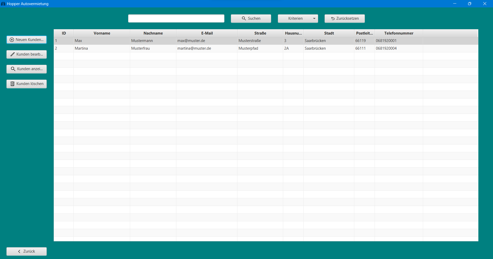
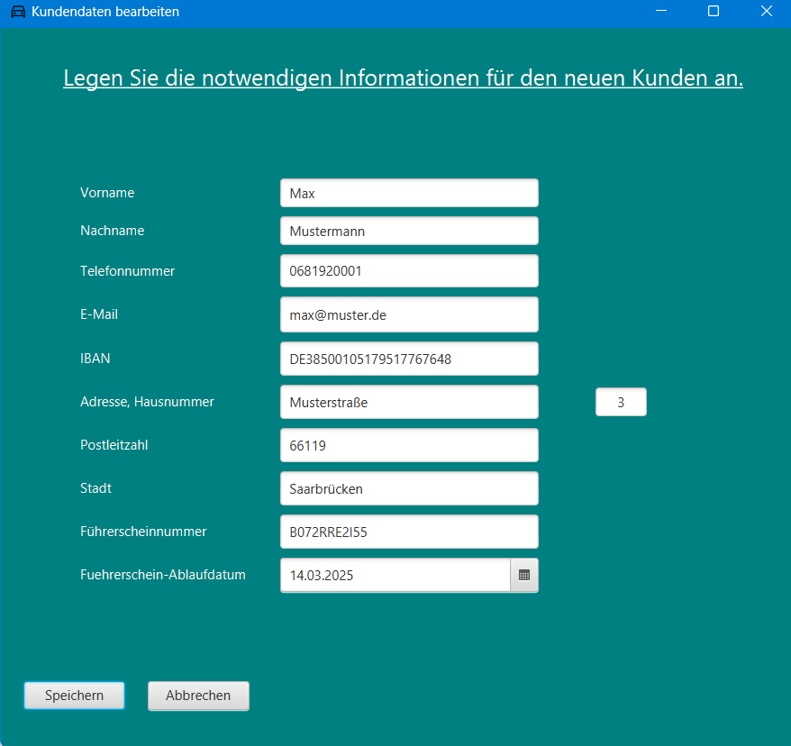
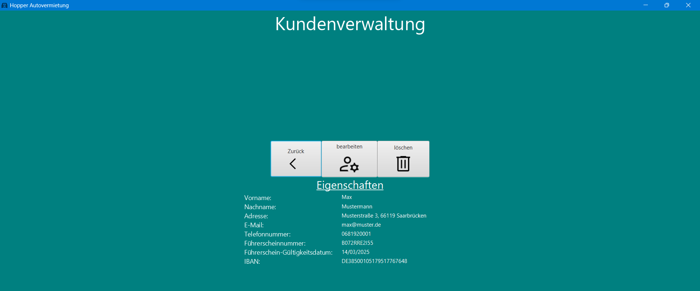
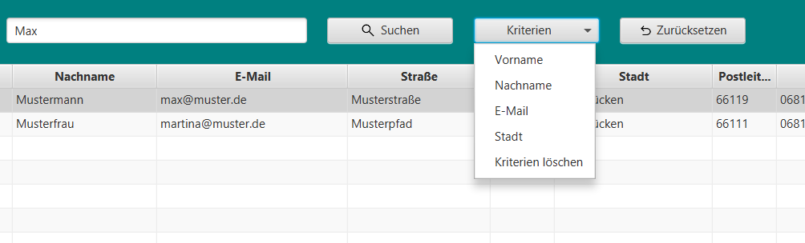

# Kundenverwaltung

Die Kundenverwaltung dient der Verwaltung der Kunden. Sie hat folgende Funktionen:

* **Neuen Kunden anlegen**
* **Kunden bearbeiten**
* **Kunden löschen**
* **Kunden anzeigen**
* **Suchen**
* **Zurück**

## Neuen Kunden anlegen

Öffnet das Fenster zum Anlegen eines neuen Kunden.

Hier können die Eigenschaften des Kunden eingetragen werden.  
Nach dem Klick auf "Speichern" wird der Kunde in der Datenbank gespeichert und das Fenster geschlossen.  
Dabei muss beachtet werden, dass die Eingabe von Daten in die Felder für das Speichern des Kunden Pflicht ist.

Durch Drücken der "Abbrechen" Taste wird das Fenster geschlossen und die Eingaben verworfen.

Während das Fenster für die Eingabe eines neuen Kunden geöffnet ist, kann nicht mehr mit der Kundenverwaltung
interagiert werden.  
Das Fenster muss zuerst wieder durch den "Abbrechen" Button geschlossen werden, oder durch das Klicken auf den "X"
Button in der oberen rechten Ecke des Fensters.

## Kunden bearbeiten

Öffnet das Fenster zum Bearbeiten eines Kunden.

Hier können die Eigenschaften des Kunden bearbeitet werden.  
Die Daten des Kunden, welcher bei der Kundenverwaltung in der Tabelle angeklickt wurde, werden in die Felder geladen.

Nach dem Klick auf "Speichern" wird der Kunde in der Datenbank gespeichert und das Fenster geschlossen.  
Analog zum Anlegen eines neuen Kunden muss auch hier die Eingabe von Daten in die Felder für das Speichern des Kunden
erfolgen.

Wenn der Kunde unverändert gespeichert werden soll, wird eine Fehlermeldung angezeigt. Es ist demnach Pflicht,
mindestens eine Eigenschaft zu ändern. Die Interaktion mit der Kundenverwaltung ist während des Bearbeitens eines Kunden
ebenfalls nicht möglich.

## Kunden löschen

Öffnet das Fenster zum Löschen eines Kunden.

Der in der Tabelle angeklickte Kunde ist ausgewählt.  
Nach dem Klick auf "Löschen" muss die Meldung "Kunde wirklich löschen?" bestätigt werden.  
Nach der Bestätigung wird der Kunde aus der Datenbank gelöscht und das Fenster geschlossen.  
Während des Löschens eines Kunden ist die Interaktion mit der Kundenverwaltung nicht möglich.

Durch den "Abbrechen" Button wird das Fenster geschlossen und der Kunde nicht gelöscht.

## Kunden anzeigen

Wechselt in das Fenster zur Anzeige der Eigenschaften eines Kunden.

Der in der Tabelle angeklickte Kunde ist ausgewählt.  
Durch den "Zurück" Button wird das Fenster geschlossen und die Kundenverwaltung wieder geöffnet.

Das Klicken auf "Löschen" oder "Bearbeiten" öffnet das entsprechende Fenster wie in den vorherigen Abschnitten
beschrieben.  
Dabei sei darauf hingewiesen, dass die Interaktion mit der Kundenverwaltung während der Bearbeitung oder Löschung eines
Kunden nicht möglich ist und beim Löschen des Kunden die Anzeige der Eigenschaften des Kunden geschlossen wird.

## Suchen

Über der Kundentabelle befindet sich ein Textfeld und ein Button "Suchen".  
Durch Eingabe eines Suchbegriffs in das Textfeld und anschließendem Klick auf den Button "Suchen" wird die Tabelle nach
Kunden gefiltert, die den Suchbegriff in ihren Eigenschaften enthalten.

Des Weiteren wird durch den Klick auf den Button "Suchen" die Tabelle wieder zurückgesetzt und alle Kunden angezeigt.

Mithilfe des Menübuttons "Kriterien" kann die Suche nach bestimmten Eigenschaften des Kunden eingeschränkt werden.

"Kriterien löschen" wechselt wieder zur allgemeinen, übergreifenden Suche nach dem Suchbegriff.

Der Button "Zurücksetzen" setzt die Tabelle wieder zurück und zeigt alle Kunden an.

## Zurück

Schließt das Fenster der Kundenverwaltung und kehrt zur Startseite zurück.