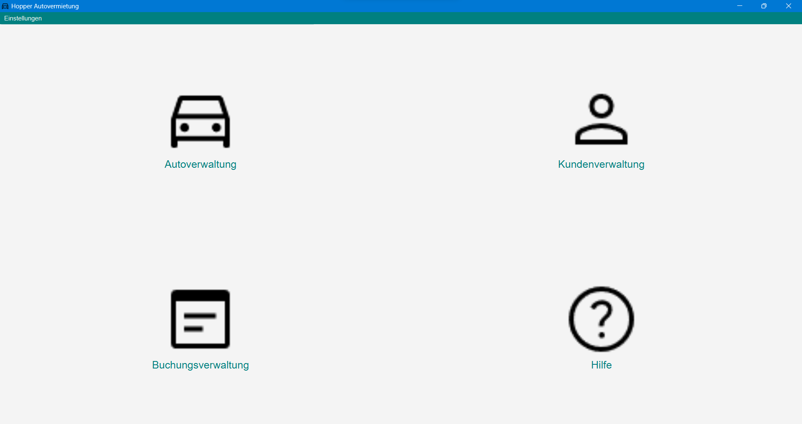

# Startseite

Auf der Startseite können die vier Hauptfunktionsbereiche des Programms aufgerufen werden.

* **Fahrzeugverwaltung**
* **Kundenverwaltung**
* **Buchungsverwaltung**
* **Hilfe**

Ein einfacher Klick auf den jeweiligen Button öffnet ein dazugehöriges neues Fenster zur Verwaltung der drei Instanzen.
Über den Button oben links können die Einstellungen des Programms geöffnet werden.